# Hometown Cafe — Responsive Product Landing Page

A responsive cafe landing page built with Laravel, Tailwind CSS, and reusable Blade components.

**Developer:** Paul Andrey A. Roldan  
**Course:** ITST 302 — Client-Server Technologies  
**Activity:** Week 5 — Responsive Product Landing Page  
**Repository:** [week05-product-landing-page](https://github.com/pol0915/week05-product-landing-page)

## Introduction

Hometown Cafe is a cafe in Pagsanjan, Laguna. This project presents its atmosphere, featured drinks, services, and contact information through a responsive landing page.

The website helps visitors explore the cafe before visiting. It brings important information together in one place, including selected menu prices, suggested food-and-drink combinations, customer experiences, and contact links.

The visual design draws inspiration from the cafe's interior. Cream backgrounds, brown typography, warm photography, and muted green accents create a welcoming appearance.

This website was developed as an academic frontend project. Content sources and implementation limitations are documented below and in [Content and Implementation Notes](documentation/content-notes.md).

## Objectives

- Create a responsive landing page using Laravel and Tailwind CSS.
- Use reusable Blade components to organize interface elements.
- Apply consistent colors, typography, spacing, and interaction styles.
- Present cafe information clearly across desktop, tablet, and mobile layouts.
- Implement navigation, package previews, and a frontend sign-in interaction.
- Document the development process through screenshots and Git commits.

## Website Sections

| Section | Description |
| --- | --- |
| Navigation | Brand identity, section links, mobile navigation, and header actions |
| Hero | Cafe photograph, introduction, and menu and location calls to action |
| Features | Six cards presenting drinks, food, and available services |
| Featured Drinks | Cafe Latte, Biscoff Latte, and Matcha Latte with reference prices |
| Product Showcase | Conceptual desktop and mobile interface previews |
| Packages | Three suggested combinations with package preview dialogs |
| Testimonials | Personal experiences from Christian A., Dhenzel C., and Paul R. |
| Contact | Cafe location, contact information, and social links |
| Footer | Brand information, quick links, and copyright information |
| Sign-In | Frontend form with validation feedback and a success state |

The package buttons use **View Package** to match the cafe context.

## Technology Stack

Versions below were reported by the local development terminal.

| Technology | Version / Purpose |
| --- | --- |
| Laravel | 12.69.1 — application structure, routing, and views |
| Blade | Reusable templates and components |
| Tailwind CSS | 4.3.3 — utility-based styling |
| Vite | 6.4.3 — asset development and production build |
| Node.js | 24.19.0 — frontend tooling runtime |
| JavaScript | Frontend interactions |
| Git and GitHub | Version control and repository hosting |
| VS Code | Code editor |

## Installation and Local Setup

### Prerequisites

- PHP and Composer compatible with the project's `composer.json`
- Node.js and npm
- Git

### 1. Clone the repository

```powershell
git clone https://github.com/pol0915/week05-product-landing-page.git
cd week05-product-landing-page
```

### 2. Install dependencies

```powershell
composer install
npm ci
```

### 3. Configure the environment

For a fresh installation:

```powershell
Copy-Item .env.example .env
php artisan key:generate
```

Update these values in `.env` for the frontend-only local setup:

```dotenv
APP_NAME="Hometown Cafe"
APP_URL=http://127.0.0.1:8000
SESSION_DRIVER=file
CACHE_STORE=file
QUEUE_CONNECTION=sync
```

Keep an existing configured `.env` when returning to an already installed project.

### 4. Build the assets

```powershell
npm run build
```

### 5. Start Laravel

```powershell
php artisan serve
```

Open:

```text
http://127.0.0.1:8000
```

### Development mode

While editing the frontend, run the following in a separate terminal:

```powershell
npm run dev
```

Keep the Laravel server running in the first terminal.

## Responsive Web Design

Responsive web design allows the interface to adapt to different screen sizes while maintaining readable content and usable controls.

This project uses a mobile-first approach. Base styles establish the smaller-screen layout, while responsive utilities adjust columns, spacing, and navigation as more space becomes available.

### Layout techniques

- **CSS Grid:** Organizes feature, product, and package cards.
- **Flexbox:** Aligns navigation links, buttons, icons, and card content.
- **Responsive utilities:** Adjust layouts at different breakpoints.
- **Flexible images:** Keep photographs within their containers.
- **Viewport-aware dialogs:** Allow modal content to remain accessible on smaller screens.

An example of a responsive card grid is:

```html
<div class="grid grid-cols-1 gap-6 md:grid-cols-2 lg:grid-cols-3">
    <!-- Cards -->
</div>
```

This pattern displays one column on smaller screens, two from the `md` breakpoint, and three from the `lg` breakpoint.

### Tailwind breakpoint reference

| Prefix | Default minimum width |
| --- | --- |
| Base styles | Applies at all widths unless overridden |
| `sm:` | 640px |
| `md:` | 768px |
| `lg:` | 1024px |
| `xl:` | 1280px |
| `2xl:` | 1536px |

Responsive screenshots are included for desktop, tablet, and mobile layouts. Browser viewport previews document layout behavior; they do not establish testing on physical devices.

## Tailwind CSS Implementation

Tailwind CSS provides utility classes for layout, spacing, typography, colors, borders, and interaction states.

Instead of creating a separate CSS rule for each element, utilities are combined directly in the markup. Blade components organize repeated combinations so that styling remains consistent.

### Examples

| Utility | Purpose |
| --- | --- |
| `grid` | Creates a grid layout |
| `flex` | Creates a flexible layout |
| `gap-6` | Adds spacing between items |
| `rounded-2xl` | Adds rounded corners |
| `items-center` | Aligns items along the cross axis |
| `bg-[#F7F3EC]` | Applies the cream background |
| `text-[#352820]` | Applies the espresso text color |
| `md:grid-cols-3` | Uses three columns from the medium breakpoint |

### Benefits in this project

- Faster iteration on spacing, colors, and proportions.
- Responsive adjustments close to the affected markup.
- Consistent styling through shared components.
- Less duplication of custom component styles.
- Clear hover and focus feedback for interactive controls.

## Blade Components and Layouts

Blade components divide the interface into reusable pieces. Components accept content through props, allowing the same structure to display different information.

### Shared layout

The main layout is located at:

```text
resources/views/layouts/app.blade.php
```

It provides the shared HTML structure and asset loading. Page views extend this layout and supply their content.

Example:

```blade
@extends('layouts.app')

@section('content')
    <x-hero />
@endsection
```

### Component organization

| Component | Responsibility |
| --- | --- |
| `navbar.blade.php` | Navigation and header actions |
| `hero.blade.php` | Main introduction and image treatment |
| `button.blade.php` | Shared button and link styles |
| `feature-card.blade.php` | Feature icon, title, and description |
| `product-card.blade.php` | Featured drink information |
| `pricing-card.blade.php` | Package card and preview |
| `testimonial-card.blade.php` | Customer identity and review |
| `showcase.blade.php` | Concept interface previews |
| `pricing.blade.php` | Package section |
| `testimonials.blade.php` | Customer experiences section |
| `contact.blade.php` | Contact information |
| `sign-in.blade.php` | Sign-in dialog |
| `footer.blade.php` | Footer content |

### Reusable button example

```blade
<x-button href="#menu" variant="primary">
    Explore the Menu
</x-button>
```

### Feature card example

```blade
<x-feature-card
    title="Classic Coffee"
    description="Keep it familiar with your favorite coffee."
    icon="coffee"
/>
```

### Testimonial component example

```blade
<x-testimonial-card
    name="Paul R."
    position="Customer"
    initials="PR"
    photo="images/pol-customer.png"
    review="I enjoyed being able to choose something beyond my usual coffee. A matcha latte, a bite to eat, and good company made for a lovely little break."
/>
```

Component reuse makes maintenance easier. Changes to a shared card or button can be applied across its instances without editing every section separately.

## UI Design

### Color palette

| Color | Hex | Purpose |
| --- | --- | --- |
| Cream | `#F7F3EC` | Main background and light surfaces |
| Espresso | `#352820` | Primary text and prominent actions |
| Wood Brown | `#886449` | Warm accents |
| Beige | `#E8DDCE` | Supporting surfaces and borders |
| Muted Green | `#315B50` | Selected backgrounds and accents |
| Light Sage | `#E6EDE5` | Supporting green-tinted surfaces |

Brown is the dominant accent, while green adds variety and connects the interface to the cafe's interior.

The features section retains a green background with light heading text. Its cards use warm neutral surfaces and brown icons.

### Typography

Serif headings give the page a relaxed cafe character. Sans-serif body text supports readability in descriptions, navigation, and forms.

Different font sizes and weights distinguish section headings, card titles, supporting information, and calls to action.

### Photography and iconography

Interior photographs communicate the cafe's atmosphere. A faded hero overlay creates space for the headline while keeping the cafe sign visible.

Line icons introduce feature categories without competing with the text. Featured drink illustrations use consistent framing.

### Buttons and cards

Rounded cards, consistent spacing, and related button styles connect the sections visually. Primary actions use prominent brown styling, while secondary actions use lighter or outlined treatments.

Featured drink cards were reduced in size to preserve visibility of the background photograph.

## Folder Structure

| Path | Purpose |
| --- | --- |
| `app/` | Laravel application classes |
| `routes/web.php` | Web route definitions |
| `resources/views/layouts/` | Shared page layouts |
| `resources/views/pages/` | Page views |
| `resources/views/components/` | Reusable Blade components |
| `resources/css/` | Source styles |
| `resources/js/` | Source JavaScript |
| `public/images/` | Images displayed on the website |
| `public/build/` | Generated production assets |
| `screenshots/` | Project screenshot evidence |
| `documentation/` | Content notes and design comparison |
| `README.md` | Project overview and setup instructions |

Documentation screenshots are stored outside `public/` because they support the repository documentation rather than the website interface.

## Screenshots

### Desktop View


### Tablet View

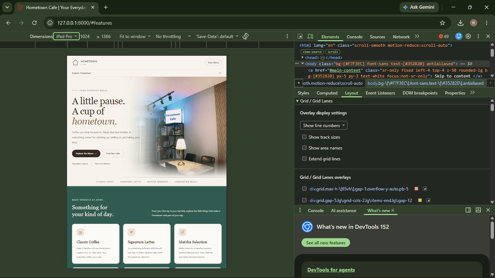

### Mobile View

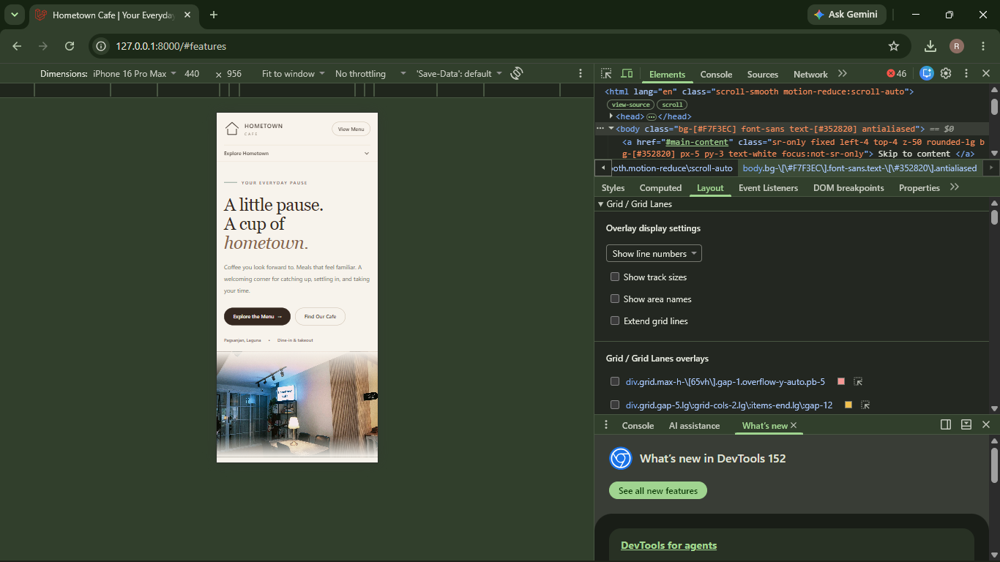

### Navigation

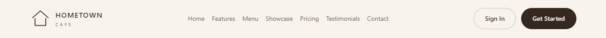

### Hero Section

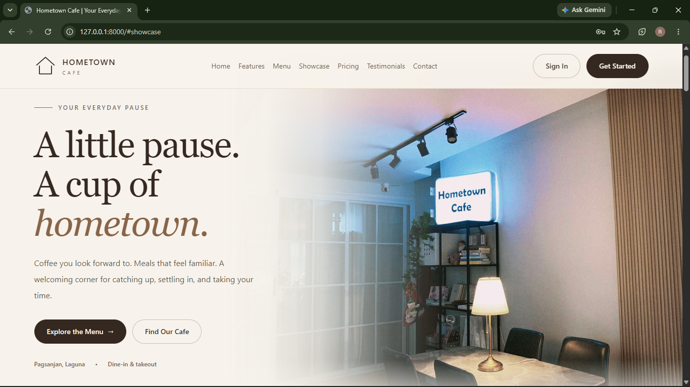

### Features Section

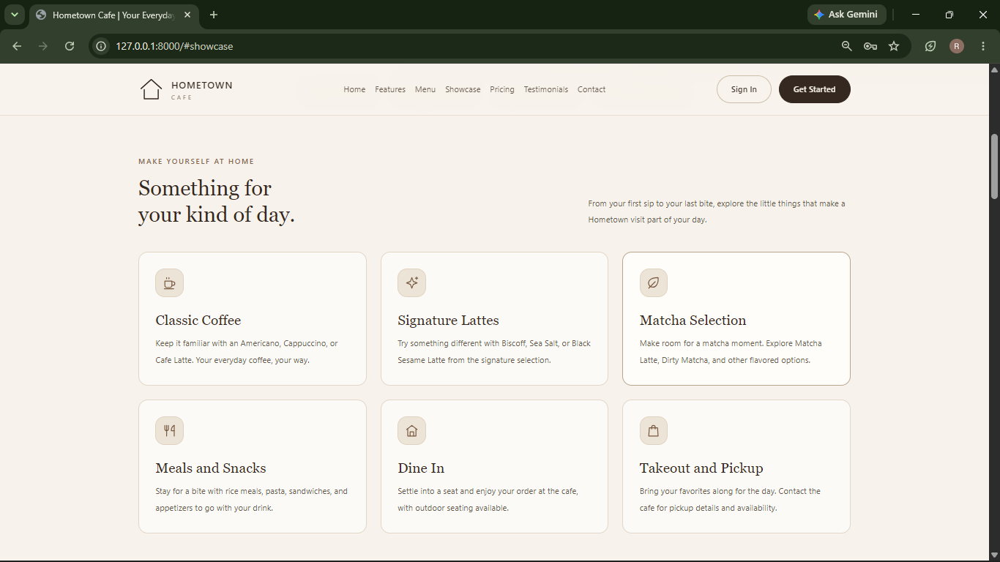

### Product Showcase

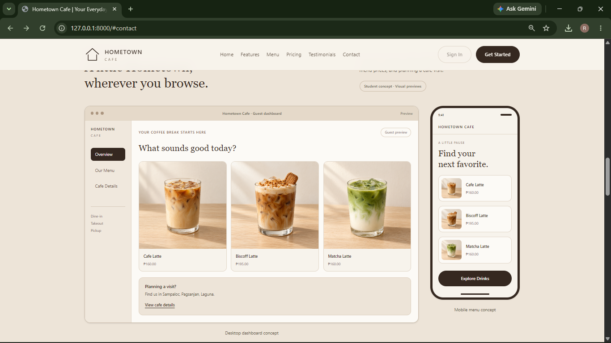

### Pricing Section

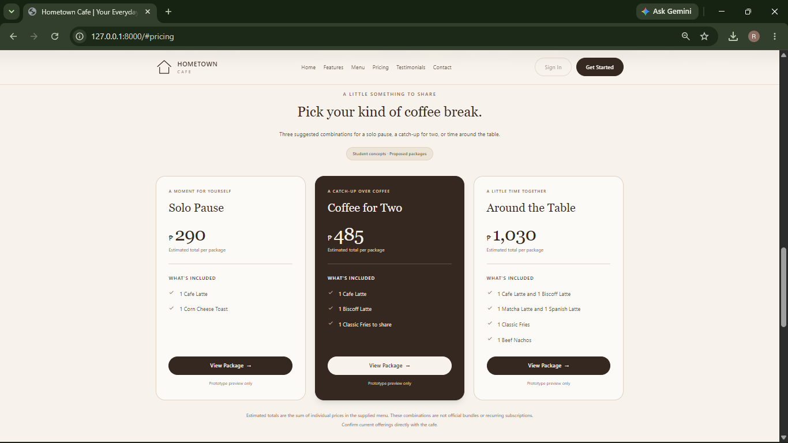

### Package Preview

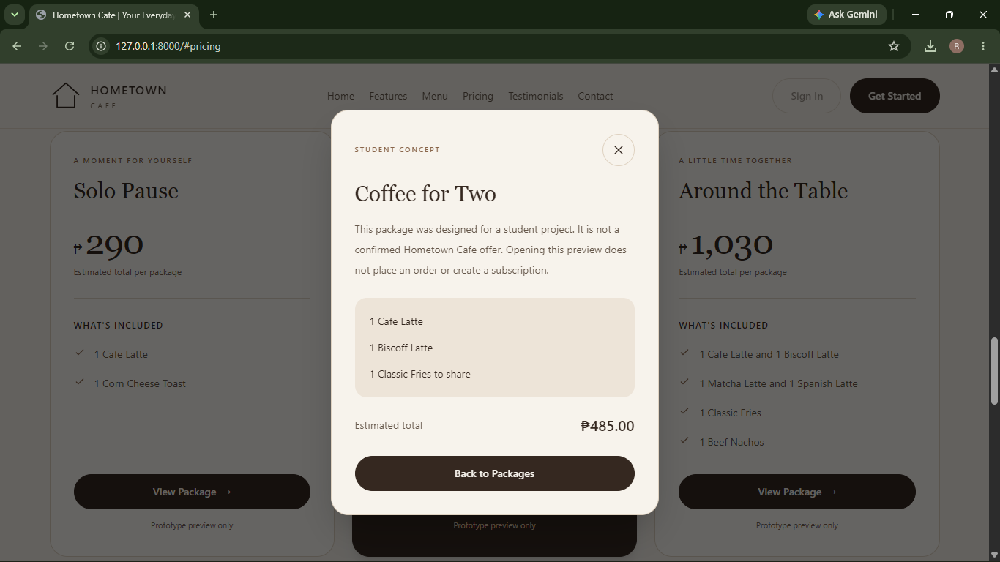

### Testimonials Section

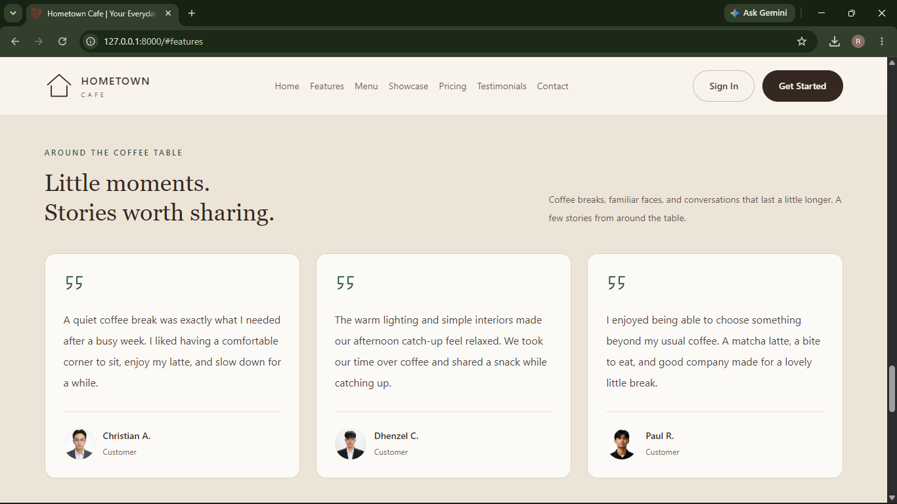

### Contact Section

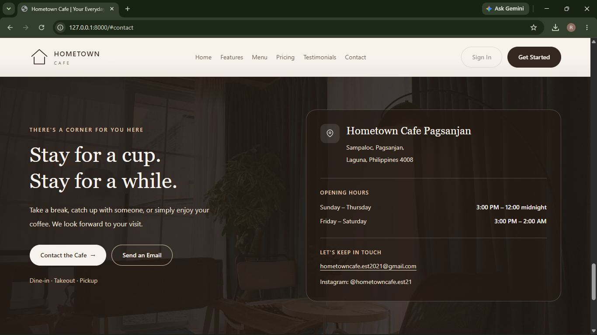

### Footer

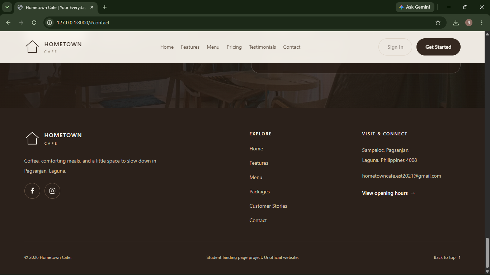

### Sign-In Modal

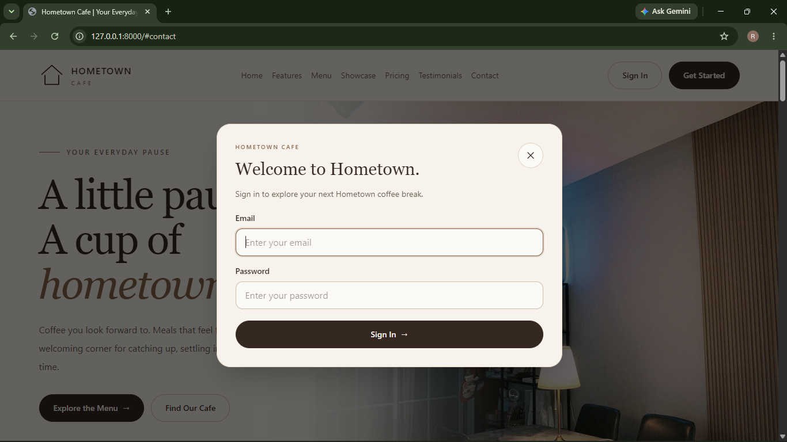

### Sign-In Success State

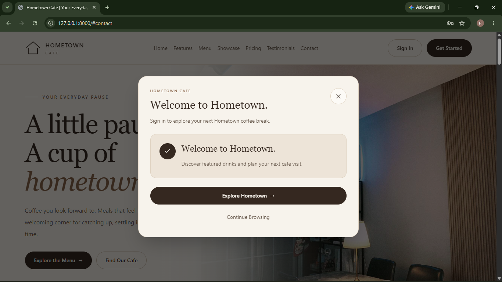

### Blade Components

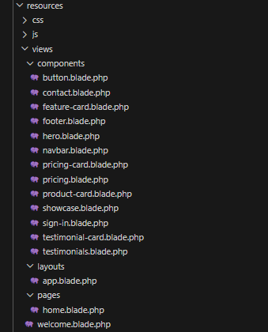

### Project Structure

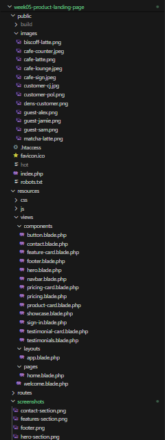

### GitHub Repository

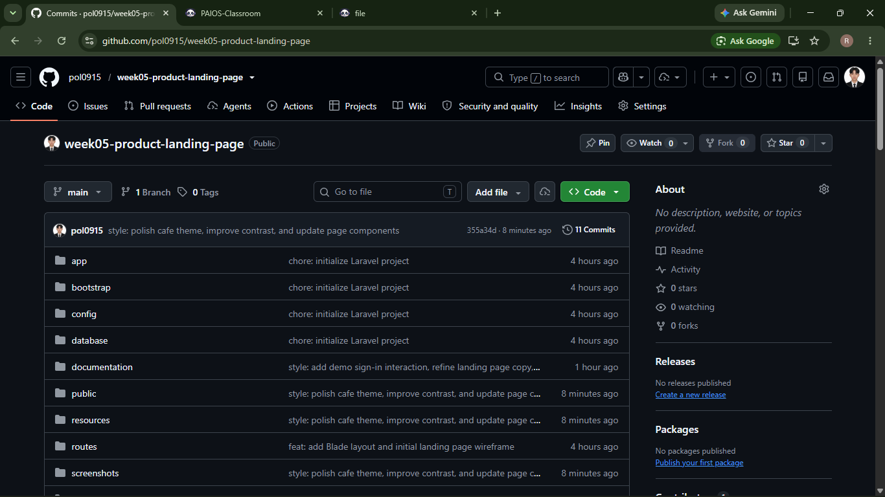

## Before and After

The initial wireframe established the page structure using basic cards, simple borders, and image placeholders.

The final design introduces cafe photography, a faded hero background, refined typography, responsive layouts, and a brown-and-cream palette with muted green accents.

### Before


### After


### Design improvements

| Initial design | Final design |
| --- | --- |
| Image placeholder | Cafe photograph with a faded overlay |
| Basic neutral styling | Coordinated cream, brown, and green palette |
| Plain product information | Compact image cards with names and prices |
| Package placeholders | Three suggested packages with preview dialogs |
| Basic section styling | Consistent spacing, typography, and icon treatments |
| Initial layout structure | Desktop, tablet, and mobile presentations |

See [Design Comparison](documentation/design-comparison.md) for additional documentation.

## Build and Development Checkpoint

The latest reported production build completed successfully:

```text
vite v6.4.3 building for production...
✓ 58 modules transformed.

public/build/manifest.json              0.27 kB
public/build/assets/app-BKQLsPS7.css    52.84 kB
public/build/assets/app-DMsN-rLE.js     51.52 kB

✓ built in 2.32s
```

At this checkpoint:

- The repository contained **12 commits**.
- The `screenshots/` folder contained **19 image files**.
- The `documentation/` folder contained **4 files**.
- Desktop, tablet, mobile, and before-and-after screenshot files were present.

These figures describe the reported checkpoint. Later commits may change them.

The successful build confirms that production assets were generated. It does not independently verify every interaction, accessibility requirement, or browser configuration.

## Problems Encountered and Solutions

| Problem | Solution |
| --- | --- |
| Git could not write an object during staging | Staging and committing succeeded from a separate PowerShell session. The exact permission cause was not established. |
| Laravel reported a missing Vite manifest | The development server or production build supplied the required frontend assets. |
| A cafe image did not appear | The image reference was corrected to match the actual `.jpeg` filename. |
| Drink cards covered too much of the background | Card dimensions were reduced while keeping consistent image proportions. |
| The sign-in modal appeared narrow and tall | Width, spacing, and viewport-based scrolling were adjusted. |
| Dark text was difficult to read on the green background | Light heading text improved readability while cards retained brown accents. |
| A bulk replacement script damaged component code | Affected files were restored, reinforcing the importance of targeted replacements and reviewing changes. |

## Content Sources and Credits

### Business references

The cafe information, interior photographs, and social account details were sourced from Hometown Cafe's Facebook page.

Menu items and reference prices were taken from the cafe's Canva menu supplied during development. Screenshots and images from these sources informed the website's content and visual design.

Prices and availability reflect the supplied references and may change.

### Product imagery

The featured Cafe Latte, Biscoff Latte, and Matcha Latte images were generated using AI as illustrative website assets.

They are not photographs of the cafe's actual drinks.

### Testimonials

The testimonials from Christian A., Dhenzel C., and Paul R. are based on our personal experiences visiting Hometown Cafe.

They describe our impressions of the drinks, food, atmosphere, and time spent at the cafe. The statements were written for this project rather than copied from public review platforms.

### Cafe packages

The packages are student-designed combinations based on the reference menu. They are not confirmed official cafe bundles.

| Suggested package | Included items | Reference total |
| --- | --- | --- |
| Solo Pause | Cafe Latte and Corn Cheese Toast | ₱290 |
| Coffee for Two | Cafe Latte, Biscoff Latte, and Classic Fries | ₱485 |
| Around the Table | Cafe Latte, Biscoff Latte, Matcha Latte, Spanish Latte, Classic Fries, and Beef Nachos | ₱1,030 |

See [Content and Implementation Notes](documentation/content-notes.md) for further details.

## Implementation Scope

This project focuses on frontend presentation and interactions.

- The showcase contains conceptual interface previews.
- Sign-in uses a frontend credential check.
- Sign-in does not provide secure backend authentication, account creation, or a server-side user session.
- Package previews display information without placing an order.
- Checkout, payment processing, and order fulfillment are not implemented.
- Menu information is not connected to a live pricing or availability service.

The frontend sign-in interaction uses these sample credentials:

```text
Email: guest@hometown.test
Password: hometown-demo
```

These credentials are for the local frontend interaction and do not grant access to a real customer account.

## Reflection

This project helped me understand how reusable Blade components and responsive utilities can turn a basic wireframe into a consistent interface.

Adjusting image sizes, contrast, and modal proportions showed me how small design decisions affect readability and visual balance. Working through implementation errors also reinforced the value of reviewing changes and maintaining meaningful Git commits.

## Documentation Files

- [Content and Implementation Notes](documentation/content-notes.md)
- [Design Comparison](documentation/design-comparison.md)
- [Before Design](documentation/before-design.png)
- [After Design](documentation/after-design.png)