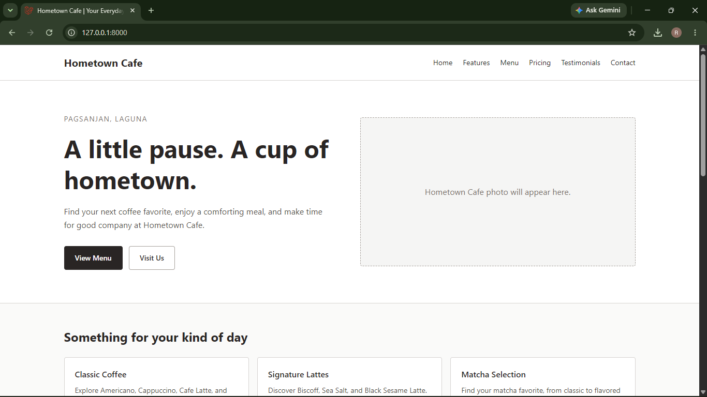
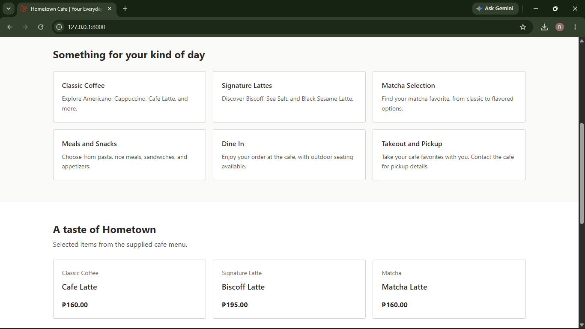
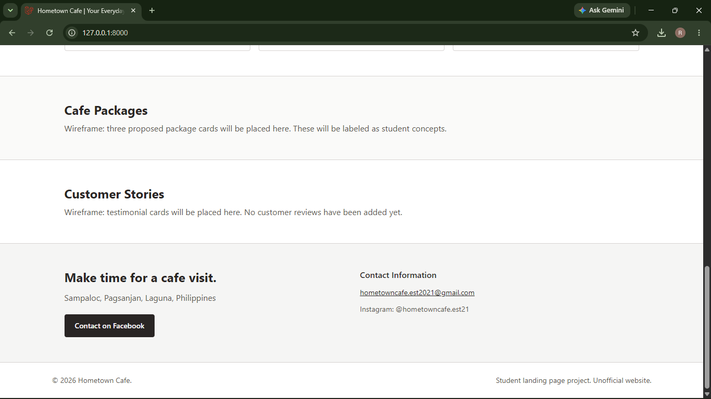
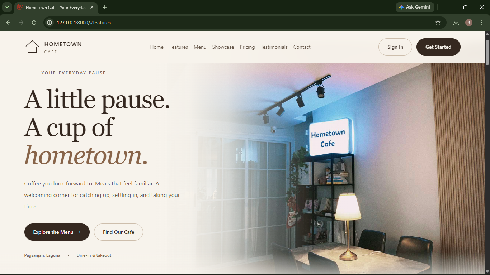

# Design comparison

## Before: initial wireframe

These are original screenshots supplied during development, copied without visual edits.

## Changes made

| Initial layout | Refined design |
| --- | --- |
| Hero image placeholder | Café photography with a faded overlay |
| Basic neutral styling | Cream and brown palette with muted green accents |
| Plain drink information | Compact image cards with names and prices |
| Package placeholders | Three suggested combinations and preview dialogs |
| Simple page sections | Shared Blade components, consistent spacing, and icon styling |
| Basic layout | Responsive navigation, card arrangements, and modal sizing |

## After: final design

The final interface uses cafe photography, consistent component styling,
improved spacing, and a brown-led palette with muted green accents.

Responsive screenshots are available in the README for desktop, tablet,
and mobile layouts.
